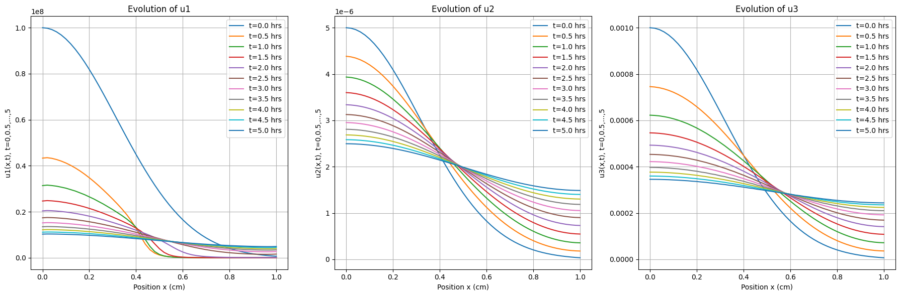

# Pattern Formation PDE Model - Machine Learning Solution

A learning-based solution for simulating pattern formation using a system of three partial differential equations (PDEs). The model describes interactions between cell density and chemical concentrations, featuring diffusion, chemotaxis, and reaction terms.

## Model Description

The system consists of three coupled PDEs representing:
- `u1`: Cell density (cells/ml)
- `u2`: Chemical concentration (M)
- `u3`: Chemical concentration (M)

Key features:
- Diffusion terms with different coefficients (D1, D2, D3)
- Chemotaxis term for u1 responding to u2 gradient
- Nonlinear reaction kinetics
- Neumann boundary conditions (zero flux)

## Requirements

- Python 3.7+
- py-pde
- NumPy
- Matplotlib

Install dependencies:
```bash
pip install py-pde numpy matplotlib
```

## Code Structure

### Main Components:
1. **PatternFormationPDE Class**:
   - Implements the PDE system
   - Handles diffusion, chemotaxis, and reaction terms
   - Uses Neumann boundary conditions

2. **Simulation Functions**:
   - `set_up_initial_state`: Creates Gaussian initial profiles
   - `solve_system`: Solves the PDE system over time
   - `print_state`: Outputs solution values at specific points
   - `plot_results`: Visualizes the evolution of all three components

3. **Parameters**:
   ```python
    params: Dict[str, float] = {
        "D1": 1.999996e-06,     # cm²/s
        "D2": 8.9e-06,          # cm²/s
        "D3": 9.0e-06,          # cm²/s
        "k1": 3.9e-09,          # M·cm²/s
        "k2": 5.0e-06,          # M
        "k3": 1.62e-09,         # h⁻¹·ml/cell (converted from hr⁻¹)
        "k4": 3.5e+08,          # cells/ml
        "k5": 5.0e-07,          # (M·s)⁻¹
        "k6": 1.0e+18,          # (cells/ml)²
        "k7": 1.0e-13,          # ml/(cell·s)
        "k8": 1.0e-14,          # s⁻¹
        "k9": 4.0e-06,          # M²
    }
   ```

### Simulation Setup:
- Spatial domain: [0, 1] cm
- Time range: 0 to 5 hours (18000 seconds)
- Time step: 30 minutes (1800 seconds)
- Initial conditions: Gaussian profiles centered at x=0

## Usage

Run the simulation:
```python
python3 pattern_formation_machine_learning_solution.py
```

### Outputs:
```
Verifying with storage data (at time point: 5.00 hours):
x (cm)		u1 (cells/ml)		u2 (M)			u3 (M)
--------------------------------------------------------------------------------
0.0000		1.0295e+07		2.4961e-06		3.4553e-04
0.0200		1.0353e+07		2.4942e-06		3.4532e-04
0.0400		1.0343e+07		2.4903e-06		3.4502e-04
0.0600		1.0313e+07		2.4846e-06		3.4439e-04
0.0800		1.0267e+07		2.4769e-06		3.4380e-04
...
```



## Refinement Studies

The code includes two refinement studies:
1. **h-Refinement**:
   - Compares solutions with different grid points
   - Accuracy increases when step size decreases by increasing grid points

2. **p-Refinement**:
   - Compares different finite difference approximation orders
   - Accuracy increases when using higher-order FD approximations
